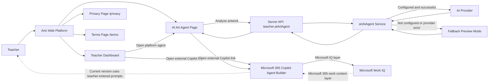

# Architecture - Art Education AI Agent

This diagram summarizes the current hackathon architecture. The Microsoft Copilot Agent Builder version is linked from the platform but does not call the backend directly in the current release.

## Components

- **Teacher**: uses the platform to review student artworks and request feedback.
- **Arts Web Platform**: React/Vite frontend that hosts the teacher workflow.
- **AI Art Agent Page**: `/teacher/ai-art-agent`, the main in-platform agent experience.
- **Server API / teacher.aiArtAgent**: protected tRPC router used by the teacher page.
- **artAiAgent Service**: server service that builds prompts, normalizes results, and returns preview fallback responses when needed.
- **AI Provider / Fallback Preview Mode**: real provider path when configured and successful; structured Arabic preview mode otherwise.
- **Microsoft 365 Copilot Agent Builder**: parallel external agent experience opened through a link.
- **Microsoft Work IQ**: the Microsoft IQ layer used by the Copilot Agent Builder path for the Agents League submission.
- **Privacy and Terms Pages**: public pages used for transparency and hackathon readiness.
